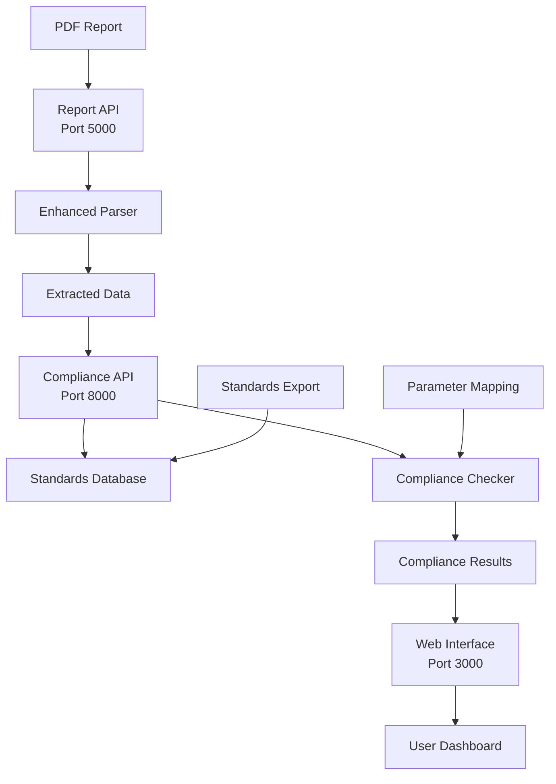

# 🏗️ Lighting Compliance Checker - Complete Project Guide

A comprehensive web-based system for extracting lighting data from PDF reports and checking compliance against international lighting standards.

## 📋 Table of Contents

- [🎯 Project Overview](#-project-overview)
- [🏗️ System Architecture](#️-system-architecture)
- [📁 Project Structure](#-project-structure)
- [🚀 Quick Start Guide](#-quick-start-guide)
- [🔧 Installation & Setup](#-installation--setup)
- [📊 Features](#-features)
- [🌐 API Documentation](#-api-documentation)
- [🛠️ Development Guide](#️-development-guide)
- [📚 Component Details](#-component-details)
- [🔍 Troubleshooting](#-troubleshooting)
- [📖 Additional Resources](#-additional-resources)

---

## 🎯 Project Overview

The Lighting Compliance Checker is a sophisticated system that:

- **Extracts** lighting data from PDF reports using advanced OCR and parsing
- **Analyzes** room layouts, luminaire specifications, and lighting parameters
- **Compares** against international lighting standards (EN 12464-1, etc.)
- **Provides** detailed compliance reports with visual representations
- **Offers** a modern web interface for easy interaction

### Key Capabilities
- ✅ PDF Report Processing (OCR + Text Extraction)
- ✅ Room Layout Analysis
- ✅ Luminaire Data Extraction
- ✅ Lighting Parameter Detection (LUX, Uniformity, Ra/CRI)
- ✅ Standards Compliance Checking
- ✅ Visual Room Diagrams
- ✅ Detailed Comparison Tables
- ✅ Batch Processing Support

---

## 🏗️ System Architecture



### Service Components
1. **Report API** (Port 5000) - PDF extraction and data processing
2. **Compliance API** (Port 8000) - Standards comparison and compliance checking
3. **Web Interface** (Port 3000) - User interface and result visualization

---

## 📁 Project Structure

```
final_comparator/
├── 📂 final project/              # Main application
│   ├── 📂 src/                   # Core application code
│   │   ├── api_server.py         # FastAPI compliance server
│   │   ├── compliance_checker.py # Core compliance logic
│   │   ├── parameter_mapping.json # Parameter aliases
│   │   └── pdf_extractor.py      # PDF utilities
│   ├── 📂 scripts/               # Utility scripts
│   ├── 📂 tests/                 # Test files
│   ├── 📂 docs/                  # Documentation
│   ├── 📂 temp/                  # Temporary files
│   ├── 📄 web_interface.html     # Main web UI
│   ├── 📄 web_server.py          # Web server
│   └── 🚀 *.bat                  # Service management
│
├── 📂 report_export/             # PDF extraction system
│   ├── 📂 api/                   # Report API server
│   ├── 📂 extractors/            # PDF parsing engines
│   ├── 📂 batch_processing/      # Batch operations
│   ├── 📂 output/                # Extracted data
│   └── 📂 docs/                  # Extraction documentation
│
├── 📂 standard_export/           # Standards database
│   ├── 📂 src/                   # Standards processing
│   ├── 📂 output/                # Standards JSON files
│   └── 📂 data/                  # Source PDFs
│
└── 📄 README.md                  # This file
```

---

## 🚀 Quick Start Guide

### 1. Prerequisites
- **Python 3.8+** with `py` command available
- **Windows OS** (batch scripts are Windows-specific)
- **Internet connection** for package installation

### 2. One-Command Setup
```bash
cd "final project"
start_all_services.bat
```

### 3. Access the System
- **🌐 Web Interface**: http://localhost:3000
- **📖 API Documentation**: http://localhost:8000/docs
- **🔧 Report API**: http://localhost:5000

### 4. Upload and Analyze
1. Open http://localhost:3000
2. Upload a PDF lighting report
3. View compliance results and analysis

---

## 🔧 Installation & Setup

### Manual Setup (Alternative)

#### Step 1: Install Dependencies
```bash
# Main application
cd "final project"
py -m pip install -r requirements.txt

# Report extraction
cd ..\report_export
py -m pip install -r requirements.txt

# Standards processing
cd ..\standard_export
py -m pip install -r requirements.txt
```

#### Step 2: Start Services Individually
```bash
# Terminal 1: Report API
cd "final project"
start_report_api.bat

# Terminal 2: Compliance API
cd "final project"
start_api.bat

# Terminal 3: Web Interface
cd "final project"
start_web_interface.bat
```

### Service Management Scripts

| Script | Purpose | Port |
|--------|---------|------|
| `start_all_services.bat` | Start all services | - |
| `restart_services.bat` | Restart all services | - |
| `start_api.bat` | Compliance API only | 8000 |
| `start_report_api.bat` | Report API only | 5000 |
| `start_web_interface.bat` | Web Interface only | 3000 |
| `cleanup_project.bat` | Clean temporary files | - |

---

## 📊 Features

### 🔍 PDF Report Extraction
- **Advanced OCR**: Uses Tesseract for text recognition
- **Layout Analysis**: Extracts room dimensions and layouts
- **Luminaire Detection**: Identifies fixture specifications
- **Parameter Extraction**: LUX, Uniformity, Ra/CRI values
- **Scene Analysis**: Multiple lighting scenarios

### 📏 Standards Compliance
- **EN 12464-1**: European lighting standards
- **Room Type Matching**: Automatic room classification
- **Parameter Comparison**: LUX, Uniformity, Ra/CRI checking
- **Pass/Fail Analysis**: Detailed compliance results
- **Margin Calculations**: Performance vs requirements

### 🎨 Web Interface
- **Modern UI**: Responsive design with CSS Grid
- **Visual Reports**: Room diagrams and comparison tables
- **Real-time Processing**: Live status updates
- **Detailed Results**: Comprehensive compliance analysis
- **Export Options**: JSON and visual reports

### 🔧 Advanced Features
- **Batch Processing**: Multiple PDF processing
- **Parameter Mapping**: Alias recognition for parameters
- **Error Handling**: Robust error management
- **Debug Tools**: Comprehensive debugging utilities
- **API Integration**: RESTful API endpoints

---

## 🌐 API Documentation

### Report API (Port 5000)

#### Endpoints
- `GET /health` - Health check
- `POST /extract` - Extract data from PDF
- `GET /files` - List processed files
- `GET /files/{filename}` - Download extracted data

#### Example Usage
```bash
# Upload and extract PDF
curl -X POST "http://localhost:5000/extract" \
  -F "file=@report.pdf"

# Check health
curl "http://localhost:5000/health"
```

### Compliance API (Port 8000)

#### Endpoints
- `GET /health` - Health check
- `GET /standards-info` - Standards information
- `POST /check-compliance-detailed` - Detailed compliance check
- `GET /docs` - Interactive API documentation

#### Example Usage
```bash
# Check compliance
curl -X POST "http://localhost:8000/check-compliance-detailed" \
  -H "Content-Type: application/json" \
  -d @extracted_data.json

# Get standards info
curl "http://localhost:8000/standards-info"
```

### Web Interface (Port 3000)

#### Features
- **File Upload**: Drag-and-drop PDF upload
- **Progress Tracking**: Real-time processing status
- **Results Display**: Comprehensive compliance analysis
- **Visual Reports**: Room diagrams and tables
- **Export Options**: Download results

---

## 🛠️ Development Guide

### Running Tests
```bash
cd "final project/tests"
py test_direct_compliance.py
py test_uniformity_extraction.py
py debug_uniformity_issue.py
```

### Debugging
```bash
# Check service status
curl http://localhost:5000/health
curl http://localhost:8000/health

# View debug files
cd "final project/temp"
# Check debug_*.json files
```

### Batch Processing
```bash
cd "final project/scripts"
py process_reports_enhanced.py
```

### Adding New Standards
1. Update `standard_export/output/enhanced_standards.json`
2. Modify `src/parameter_mapping.json` for aliases
3. Test with `tests/test_enhanced_standards.py`

---

## 📚 Component Details

### Report Export System
**Location**: `report_export/`

**Key Files**:
- `api/api_server.py` - Report extraction API
- `extractors/enhanced_parser.py` - Advanced PDF parser
- `extractors/layout_enhanced_extractor.py` - Layout analysis
- `batch_processing/batch_processor.py` - Batch operations

**Documentation**: `report_export/docs/`

### Standards Database
**Location**: `standard_export/`

**Key Files**:
- `output/enhanced_standards.json` - Main standards database
- `src/` - Standards processing scripts
- `data/` - Source PDF standards documents

**Documentation**: `standard_export/README.md`

### Main Application
**Location**: `final project/`

**Key Files**:
- `src/compliance_checker.py` - Core compliance logic
- `src/api_server.py` - Compliance API server
- `web_interface.html` - Main web UI
- `web_server.py` - Web server

**Documentation**: `final project/docs/`

---

## 🔍 Troubleshooting

### Common Issues

#### 1. Port Conflicts
**Problem**: Services won't start due to port conflicts
**Solution**:
```bash
# Check what's using the ports
netstat -ano | findstr :3000
netstat -ano | findstr :5000
netstat -ano | findstr :8000

# Kill processes if needed
taskkill /f /im python.exe
```

#### 2. Python Not Found
**Problem**: `py` command not recognized
**Solution**:
- Install Python from python.org
- Ensure Python is added to PATH
- Use `python` instead of `py` if needed

#### 3. Dependencies Issues
**Problem**: Import errors or missing packages
**Solution**:
```bash
# Reinstall requirements
py -m pip install -r requirements.txt --force-reinstall
```

#### 4. PDF Processing Fails
**Problem**: PDF extraction returns empty results
**Solution**:
- Check PDF is not password-protected
- Ensure PDF contains text (not just images)
- Try with a different PDF format

#### 5. Compliance Results Show "NO_CHECKS"
**Problem**: No compliance checks performed
**Solution**:
- Verify all services are running
- Check extracted data contains room information
- Ensure standards database is loaded

### Debug Tools

#### Service Health Checks
```bash
# Check all services
curl http://localhost:5000/health
curl http://localhost:8000/health
```

#### Debug Files
- `final project/temp/debug_*.json` - Debug output
- `final project/temp/*_test_result.json` - Test results
- Console output in service windows

#### Test Scripts
```bash
cd "final project/tests"
py simple_debug_test.py
py test_direct_compliance.py
```

---

## 📖 Additional Resources

### Documentation Links
- [Final Project Documentation](final%20project/docs/README.md)
- [Report Export Guide](report_export/docs/README.md)
- [Standards Export Guide](standard_export/README.md)
- [Project Structure Details](final%20project/PROJECT_STRUCTURE.md)

### API Documentation
- [Compliance API Docs](http://localhost:8000/docs) (when running)
- [Report API Interface](report_export/api/api_interface.html)

### Test Files
- [Direct Compliance Test](final%20project/tests/test_direct_compliance.py)
- [Uniformity Extraction Test](final%20project/tests/test_uniformity_extraction.py)
- [System Integration Test](final%20project/tests/test_complete_system.py)

### Utility Scripts
- [Batch Processing](final%20project/scripts/process_reports_enhanced.py)
- [Project Organization](final%20project/organize_project.bat)
- [Cleanup Utility](final%20project/cleanup_project.bat)

### Configuration Files
- [Parameter Mapping](final%20project/src/parameter_mapping.json)
- [Enhanced Standards](standard_export/output/enhanced_standards.json)
- [Requirements](final%20project/requirements.txt)

---

## 🎯 Quick Reference

### Start Everything
```bash
cd "final project"
start_all_services.bat
```

### Access Points
- **Web Interface**: http://localhost:3000
- **API Docs**: http://localhost:8000/docs
- **Report API**: http://localhost:5000

### Key Commands
```bash
# Restart services
restart_services.bat

# Clean up
cleanup_project.bat

# Run tests
cd tests && py test_direct_compliance.py
```

### File Locations
- **Main App**: `final project/`
- **PDF Extraction**: `report_export/`
- **Standards**: `standard_export/`
- **Tests**: `final project/tests/`
- **Scripts**: `final project/scripts/`

---

## 📞 Support

For issues or questions:
1. Check the troubleshooting section above
2. Review debug files in `final project/temp/`
3. Run test scripts to verify functionality
4. Check console output in service windows

---

**🎉 Happy Lighting Analysis!** 

*This system provides comprehensive lighting compliance checking with modern web interface and robust PDF processing capabilities.*